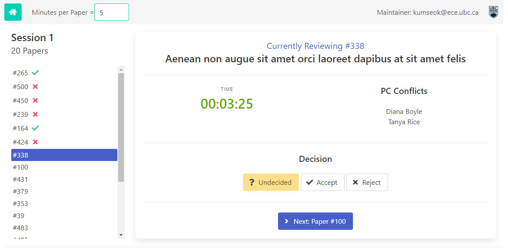

# Program Committee Meeting Dashboard

This web application is used during a Program Committee meeting to keep track of papers being reviewed, and **it is meant to be displayed on a screen using a projector**. This app **should be used exclusively by the PC chair**, as the app will **contain confidential information**.

It provides the following features:

* Announce PC conflicts before each paper
* Keep track of the time
* Keep track of the decision

You can [check out the demo here](https://dependablesystemslab.github.io/PCMeetingDashboard).




## Quick Start

This repository contains the complete web application and the Express.js web server to serve the application. To quickly start the application, simply run the following commands from the root of the repository. You will need a Node.js runtime:

1. To install the dependencies (e.g., Express.js): `npm install`
2. To serve the application: `npm start`

The application will be served at `localhost:3000`. The application will contain mock data, which can be replaced with the real data downloaded from HotCRP. The section below describes how to use the application with real data.


## How to use

This web application is a fully client-sided application built with Vue.js. The [`src`](src) directory contains all the code for the application, including the Vue.js and third-party CSS files. *The `data` directory is the only place that needs to be updated in order to work with real data.* The `src` directory contains the following:

```
/assets/
/data/
    /manifest.json
    /pcinfo.json
    /order{N}.json
/index.html
/app.js
```

* [`assets`](src/assets) directory contains third-party library code, images, and font files used by the application.
* [`index.html`](src/index.html) is the entry point of the web application
* [`app.js`](src/app.js) is the main Vue.js application.
* [`data`](src/data) directory should be updated to use the data downloaded from HotCRP system.
    * [`data/manifest.json`](src/data/manifest.json) contains the mapping of files, specifying which file to use for the program committee list and the list of papers. It contains a `sessions` array, which contains a list of JSON files, each mapping to the list of papers to be discussed in the session.
    * [`data/pcinfo.json`](src/data/pcinfo.json) is a JSON file containing basic information about the PC members. This file is used to map the PC committe emails to their first and last names. If you use a different file, `manifest.json` must be updated to point to that file. This file can be generated by using the [`jsonify-pcinfo.js`](scripts/jsonify-pcinfo.js) script and the PC committee CSV file downloaded from HotCRP.
    * Each `data/order{N}.json` contains the list of papers to discuss in a session. This JSON file is downloaded directly from the HotCRP website. We do not disclose further details here due to privacy and security concerns. If you have any questions, send an email to the repository owner.

After updating the contents in the `data` directory, simply serve the `src` directory as a web application. **Please read the security warning below** before you use it.


### Security Warning

This web-app has **absolutely no security mechanisms** in place, therefore **must be used as a local web page** by serving it at `localhost` or `127.0.0.1`. **Do not even serve it in a Local Area Network** as other people in the network will be able to access the page.

**It is extremely important** to follow this practice, as *all the data and code for this web-app is on the client-side*, and it contains sensitive information.

Additionally, the decision data are saved using `window.localStorage`, which means that the data persists in the disk. Make sure to clear the data after the PC meeting is over, to prevent any leaks when using a shared PC.


### Commands

* `npm install` to install dependencies (e.g., Express.js)
* `npm start` to serve the `src` directory at `localhost:3000`


## License

MIT
